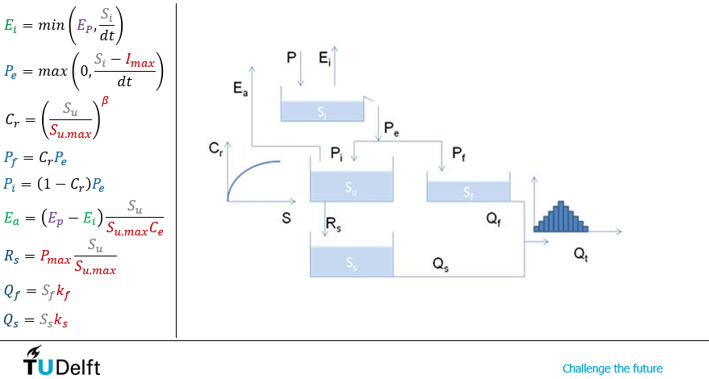

.. eWaterCycle-HBV documentation master file, created by
   sphinx-quickstart on Thu Mar  7 10:34:21 2024.
   You can adapt this file completely to your liking, but it should at least
   contain the root `toctree` directive.

Model
===========================================

HBV (Hydrologiska Byråns Vattenbalansavdelning) is a conceptual
hydrological model. For more information on it’s history, see this
`paper <https://hess.copernicus.org/articles/26/1371/2022/>`__.

This current implementation is *without* a snow reservoir as shown in the diagram below.

This implementation of the model uses a Markov Chain structure to allow it to be compatible with `Data Assimilation <https://github.com/Daafip/eWaterCycle-DA>`__.
Testing it compared to a normal implementation showed this doesn't affect how the model performs.

